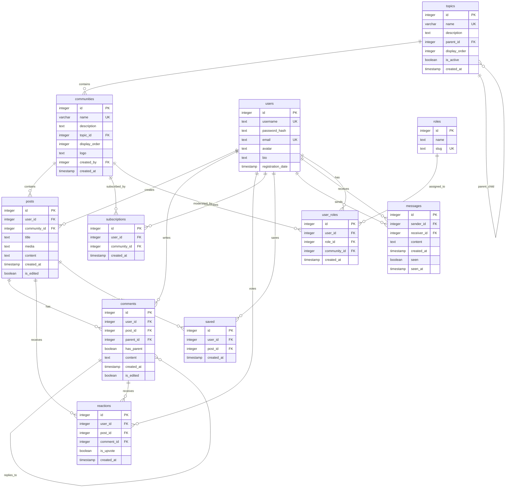

# Threaddit - a reddit clone (EOL)

**Note:** This project is currently EOL and is not being actively developed or maintained.


Threaddit is a full-stack Reddit clone; it's a comprehensive web application inspired by Reddit, built using Flask and its diverse libraries for the backend, combined with PostgreSQL for robust database management. The frontend is developed using React.js and its rich set of libraries, offering a seamless and dynamic user experience.

# Contents

- [Introduction](#introduction)
- [Technologies](#technologies)
  - [Backend](#backend)
  - [Frontend](#frontend)
  - [Database](#database)
- [Features](#features)
  - [User](#user)
  - [Subthread](#subthread)
  - [Posts Browsing](#posts-browsing)
  - [Post](#post)
  - [Comments](#comments)
  - [Messages](#messages)
- [Project Setup Instructions](#project-setup-instructions)
  - [Database Setup](#database-setup)
  - [Backend Setup](#backend-setup)
  - [Running the Application](#running-the-application)
  - [Access the Application](#access-the-application)
- [Hosting](#hosting)

# Introduction

Threaddit is a personal portfolio project inspired by Reddit that replicates some of Reddit's core features. While not intended as a fully functional product, Threaddit serves as a demonstration of various web development skills and technologies.

The backend of Threaddit is built with Flask, PostgreSQL, and several associated libraries for robust database management. On the frontend, React.js is used to create a dynamic and responsive user interface. The project also leverages additional technologies like tanstack/react-query, Axios, React Router Dom, Framer Motion, and PropTypes to enhance the overall user experience.

Please note that Threaddit is a work in progress, and features may be added or removed as the project evolves.

# Technologies

## Backend

For the backend of this project, a stack of versatile technologies has been employed. Python serves as the foundation, providing the flexibility and robustness necessary for web application development. The Flask framework, known for its simplicity and efficiency, has been instrumental in building the core structure. Additional libraries such as Flask Login, Flask Marshmallow, Flask SQLAlchemy, and Bcrypt have been integrated to enhance functionality, handle data, and ensure security. A full list is in requirements.txt.

## Frontend

On the front end, the project leverages a stack of essential technologies and libraries. React.js, the cornerstone of the frontend, provides the foundation for building dynamic and responsive user interfaces. To handle data communication with the backend and manage application state effectively, the project incorporates "tanstack/react-query. Axios is also integrated for efficient API requests, while React Router Dom ensures seamless navigation within the application. For added interactivity and animations, Framer Motion is utilized, enhancing the overall user experience. The project also employs PropTypes for enhanced type checking and validation.

## Database

The project's backend relies on PostgreSQL, a robust and open-source relational database system, to effectively handle data storage and management. The database schema has been enhanced to support hierarchical category structures for better organization of subthreads.

### Enhanced Schema for Hierarchical Categories

The database schema has been enhanced to support Reddit-like hierarchical category structures with separate topics and communities:

```sql
-- Topics table for main categories (hierarchical structure)
CREATE TABLE topics (
    id SERIAL PRIMARY KEY,
    name VARCHAR(100) NOT NULL UNIQUE,
    description TEXT,
    parent_id INTEGER REFERENCES topics(id),
    display_order INTEGER DEFAULT 0,
    is_active BOOLEAN DEFAULT TRUE,
    created_at TIMESTAMP DEFAULT NOW()
);

-- Enhanced communities table (flat structure)
ALTER TABLE subthreads RENAME TO communities;
ALTER TABLE communities ADD COLUMN topic_id INTEGER REFERENCES topics(id);
ALTER TABLE communities ADD COLUMN display_order INTEGER DEFAULT 0;
```

### ERD (Entity-Relationship Diagram)

#### Database Schema Overview



#### Hierarchical Category Structure


#### Enhanced Communities Table Structure


### Schema Structure

- **topics**: Main categories for organizing communities (hierarchical structure)
  - `id`: Primary key
  - `name`: Topic name (e.g., "Technology", "Games", "Entertainment")
  - `description`: Topic description
  - `parent_id`: For nested topics (optional)
  - `display_order`: For custom ordering
  - `is_active`: Boolean flag for active topics
  - `created_at`: Creation timestamp

- **communities**: Main table for communities/threads (flat structure)
  - `id`: Primary key
  - `name`: Community name (e.g., "react", "javascript")
  - `description`: Community description
  - `topic_id`: Reference to topics table
  - `display_order`: For custom ordering within topics
  - `logo`: Community logo/icon
  - `created_by`: Reference to users table
  - `created_at`: Creation timestamp

### Category Examples

```
Technology
├── react
├── javascript
├── python
├── webdev
└── programming

Games
├── gaming
├── minecraft
├── valorant
└── leagueoflegends

Entertainment
├── movies
├── tvshows
└── anime

Lifestyle
├── fitness
├── cooking
└── travel
```

Details about the complete schema, views, and relationships can be found in the backend folder as an SQL file.

# Features

In this project, I've implemented a set of features, which are shown below. It's important to note that features may be added or removed depending on development progress and evolving project goals. Additionally, there are pending features currently in development, as this project remains a work in progress.

## User

- [x] Login & Logout
- [x] Register
- [x] Edit Profile
- [x] Delete Account
- [ ] Email Verification
- [ ] Password Change
- [ ] Notifications

## Subthread

- [x] Subthread Creation
- [x] Subthread Edit (by Mod, Admin, and Creator)
- [x] Subthread Moderation (by Mod and Admin)
- [x] Join Subthread
- [x] Leave Subthread
- [x] Search Subthreads
- [x] Subthread Logo and Descriptions
- [ ] Banner & Rules

## Posts Browsing

- [x] Sort by Top, Hot, and New
- [x] Sort by duration.
- [x] Responsive Layout
- [ ] Ability to change layout
- [ ] Card and Gallery Layout

## Post

- [x] Post Creation
- [x] Post Edit
- [x] Post Delete (by Mod, Admin, and Creator)
- [x] Post Save & Unsave
- [x] Ability to add an image to a post
- [x] Ability to add video and gifs
- [ ] Report Posts
- [x] Use Markdown instead of plain text.

## Comments

- [x] Create Comments
- [x] Edit Comments & Edit Indicator
- [x] Delete Comments
- [x] Comment Tree with on-demand expansion
- [ ] Media as Comment
- [ ] Save Comments
- [x] Use Markdown instead of plain text.

## Messages

- [x] Send & Receive
- [x] Message Seen Indicator
- [ ] Delete Messages
- [ ] Edit Messages
- [ ] Send Media

## Project Setup Instructions

### Database Setup

- Ensure that PostgreSQL is installed on your system.
- Create a PostgreSQL database with a name of your choice.
- Make sure you have the necessary credentials (username and password) for this database.
- Details about the schema, views, and realtions can be found in the backend folder in a SQL file.

### Backend Setup

1. Navigate to the project's backend folder.

2. Create a `.env` file in the backend folder and include the following environment variables:

```env
DATABASE_URI=your_postgresql_database_uri
SECRET_KEY=your_flask_secret_key
CLOUDINARY_CLOUD_NAME=your_cloudinary_cloud_name
CLOUDINARY_API_KEY=your_cloudinary_api_key
CLOUDINARY_API_SECRET=your_cloudinary_api_secret
```

Replace the placeholder values with your specific credentials.

### Running the Application

1. With the database set up and the environment variables configured, execute the `run.py` file in the backend folder to start the Flask application.
2. Open a terminal, navigate to the backend folder, and run: `python run.py`

This will start the Flask server.

### Access the Application

- Once the Flask server is running, you can access the application by opening a web browser and navigating to the URL where it's hosted, or you can use `localhost` if you're running it locally.

By following these steps, you should have the project up and running with the necessary database schema and environment variables configured. Make sure to replace the placeholder values with your actual credentials and API keys.

# Hosting

The project is currently hosted on [render.com](https://www.render.com), utilizing their free tier hosting service, primarily driven by financial considerations. The database, which is PostgreSQL, is hosted on Neon DB's free tier, ensuring data accessibility while staying within budget constraints. The project involves user-uploaded images, which are stored and served via Cloudinary's free tier, offering a reliable solution for handling media assets. For those interested in exploring the project, it's accessible at [threaddit.onrender.com](https://threaddit.onrender.com), providing a glimpse into this cost-effective yet functional web application.
